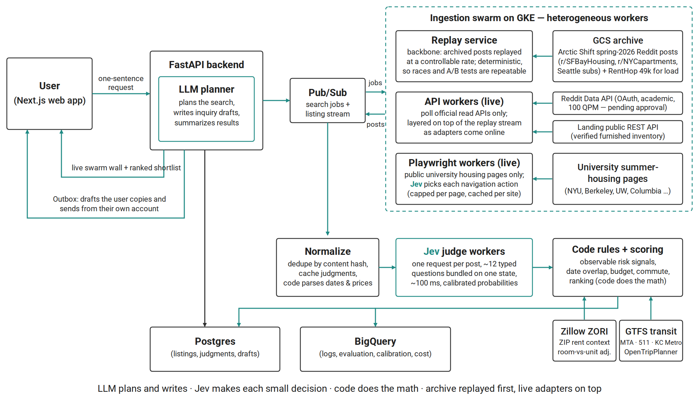

# SoftLanding

**A real-time multi-agent system for finding short-term intern housing.**

SoftLanding is a non-commercial course project for Harvard's [AC215](https://harvard-iacs.github.io/2026-AC215/projects/) (fall 2026). It helps students and interns who move to a new city for a 10–12 week summer internship find short-term, furnished housing that matches their exact dates.

> **Status:** early development (Milestone 1 — proposal). Components below marked *planned* are not implemented yet.

---

## The problem

Interns need housing that fits specific dates, budget, location, commute and room preferences. Relevant listings are scattered across housing subreddits, university summer-housing pages and furnished-housing operators, and good sublets go quickly. Today interns read hundreds of posts by hand, and rental-listing scams are common enough that the [FTC publishes guidance on them](https://consumer.ftc.gov/articles/rental-listing-scams).

## What SoftLanding does

1. The user describes what they need in one sentence, for example *"Summer sublet in SF, June 1 – Aug 20, under $2,000, near Caltrain."*
2. An LLM planner turns that sentence into structured search constraints.
3. Worker processes ingest listings from several sources in parallel.
4. For each listing, **Jev** (TypeSafe's typed-decision model) answers about 12 narrow questions (furnished? private room? dates stated? offering or seeking?) in one request, and returns calibrated probabilities.
5. Deterministic code parses dates and prices, computes date overlap and commute time, checks observable risk signals, and ranks the results.
6. The user sees a live "swarm wall" and a ranked shortlist, and every item links back to its original source. Draft inquiries go to an Outbox that the user reviews, copies and sends from their own account; **SoftLanding never sends messages on anyone's behalf.**

**Design principle:** the LLM plans and writes, Jev makes each small decision, and code does the math.

## Architecture



| Layer | Technology |
|---|---|
| Frontend | Next.js |
| Backend / planner | FastAPI + LLM |
| Messaging | Google Cloud Pub/Sub |
| Workers | Replay service, API workers, Playwright workers on GKE |
| Typed decisions | TypeSafe Jev (direct API or OpenRouter) |
| Storage | Postgres (listings, judgments, drafts), GCS (archive), BigQuery (logs, evaluation, cost) |
| Commute | GTFS feeds + OpenTripPlanner / r5py |
| Deployment | GKE with autoscaling, CI/CD, monitoring |

## Data sources

The data plan is **archive-first**: a replayed archive stream is the backbone, and live adapters are layered on top as they come online. Every source publishes into the same Pub/Sub topic, so the judge pipeline does not care where a post came from.

| Source | Role | Access |
|---|---|---|
| [Arctic Shift](https://github.com/ArthurHeitmann/arctic_shift) spring-2026 Reddit posts | Backbone: replayed at a controllable rate for demos, A/B tests and evaluation | Public bulk dumps |
| [Two Sigma RentHop](https://www.kaggle.com/competitions/two-sigma-connect-rental-listing-inquiries) (Kaggle) | Load and throughput testing only | Kaggle download |
| Reddit Data API | Live adapter for new posts in a few housing subreddits | OAuth, read-only, **pending approval** |
| [Landing public API](https://www.hellolanding.com/api/public) | Verified furnished inventory and price sanity check | Public REST, no auth |
| University summer-housing pages (NYU, Berkeley, UW, Columbia) | Live adapter; the only sources that use a browser | Public pages, Playwright |
| [Zillow ZORI](https://www.zillow.com/research/data/) | ZIP-level rent context | Public CSV |
| GTFS (MTA, 511.org, King County Metro / Sound Transit) | Commute times | Open data |

**Not used:** Facebook and Craigslist (both prohibit automated access), and any automated browser access to Reddit.

## Reddit data use

SoftLanding accesses Reddit only through the official Data API, under an approved OAuth application.

- **Read-only.** The app never posts, comments, votes, sends messages or chats, and it does not act on behalf of other users.
- **Limited scope.** It reads recent public posts from r/SFBayHousing, r/NYCapartments and r/SeattleWA, at fewer than 10 requests per minute (the limit is 100 QPM).
- **Minimal fields.** It stores title, body text, creation time, flair and permalink. It does not collect user profiles or post histories.
- **No training.** Posts are classified at inference time by code rules and an AI model. Reddit data is **never** used to train or fine-tune any model.
- **Links back.** Every shortlist item links to the original Reddit post, and all conversations happen on Reddit between the user and the poster.
- **No redistribution.** Data stays in a private course database on Google Cloud and is never sold or shared.
- **Deletion.** Posts that are deleted or removed on Reddit are dropped the next time they are checked, and all Reddit data will be deleted when the course ends (by December 31, 2026).
- **User-Agent:** `softlanding/0.1 by u/<reddit-username>`

Questions about data use: haolin_wan@hms.harvard.edu

## Evaluation (planned)

All metrics are measured on the replayed stream, so every run sees identical input.

- Sustained throughput of 600+ unique posts per minute, and p95 per-post latency under 2 s.
- Precision@10 within 0.05 of an LLM-only baseline, at 10× lower latency and 20× lower inference cost.
- Calibration of Jev's probabilities against our labels (ECE and Brier score).
- Recall and false-positive rate for observable risk signals, reported with 95% confidence intervals.
- Cost per 1,000 posts.

Labels: 500+ team-labeled posts (two annotators each), 600–1,000 query–listing relevance judgments, and 200–300 duplicate pairs. SoftLanding flags *observable risk signals*; it does not claim that any listing is definitely a scam.

## Repository layout (planned)

```
frontend/        Next.js web app (Launch, Swarm wall, Outbox)
backend/         FastAPI service and LLM planner
workers/
  replay/        Archive replay service → Pub/Sub
  adapters/      Reddit API and Landing REST workers
  browser/       Playwright workers for university pages
judge/           Jev request builder, caching, dedupe
scoring/         Date overlap, commute, risk rules, ranking
eval/            Labeling tools, metrics, calibration reports
infra/           Kubernetes manifests, CI/CD, monitoring
docs/            Proposal, architecture diagram
```

## Getting started (planned)

Setup instructions will be added at Milestone 2 (containerized data pipeline). Secrets such as Reddit OAuth credentials and model API keys will be kept in GCP Secret Manager and never committed to this repository.

## Milestones

| Milestone | Deliverable | Due |
|---|---|---|
| MS2 | Archive corpus, replay service, data pipeline, app skeleton | Oct 20 |
| MS3 | Jev judge, risk-signal rules, Landing and university adapters, SF Bay Area end-to-end | Nov 12 |
| MS4 | Swarm wall, Outbox, Reddit live adapter (if approved), CI | Dec 1 |
| MS5 | GKE scale-out, NYC and Seattle, full evaluation, live demo at the Dec 10 showcase | Dec 11 |

## Team

The InternShiper (Canvas group #52): Chuqing Qiao, Haolin Wan, Xinyi Ren, Yizhe Dai.

## Acknowledgments

- TypeSafe, [How to build with TypeSafe](https://docs.typesafe.ai/concepts/how-to-build-with-system-one) and [Jev 1.13 jaggedness](https://docs.typesafe.ai/model-jaggedness/jev-1.13)
- browser-use, [jev-ultrafast](https://github.com/browser-use/jev-ultrafast); J. Kudish, [jev-browser](https://github.com/jkudish/jev-browser)
- X. Deng et al., [Mind2Web](https://arxiv.org/abs/2306.06070), NeurIPS 2023
- Harvard IACS, [AC215](https://harvard-iacs.github.io/2026-AC215/projects/)
